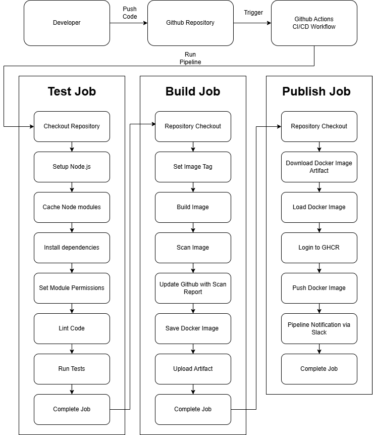

# Node.js REST API with CI/CD

This project is a sample Node.js REST API built with Express.js, showcasing key DevOps practices such as API versioning, automated testing, Docker image creation, and secure CI/CD deployment using GitHub Actions and GitHub Container Registry.

##  Project Overview

This repository provides a scaffolded API boilerplate and GitHub Actions workflow to standardize the development lifecycle across microservices.

It includes:

- A REST API whose root `/` endpoint returning a sample "Hello World!' message response.
- A `/status` endpoint that returns dynamic metadata:
  - `description` from a JSON file
  - `version` from metadata and CI/CD Build Number
  - `sha` from latest Git commit hash
- A Github Actions Workflow to package the Application into a Docker Image and publish to Github Container Registry.

##  Features

-  Express.js REST API
-  Metadata-driven versioning
-  Git commit SHA extraction
-  Dockerfile for containerization
-  GitHub Actions pipeline for:
  - Verification and Testing
  - Building, Tagging and Scanning Docker Image
  - Publishing to GitHub Container Registry

##  Project Structure

```
├── .github/workflows/          # GitHub Actions pipeline
│   └── publish-github-packages.yml
├── Dockerfile                  # Docker build instructions
├── index.js                    # Main API server logic
├── metadata.json               # App description and base version
├── package.json                # Project metadata and scripts
└── eslint.config.mjs           # eslint code config
├── test/                       # Test cases using Jest & Supertest
    └── api.test.js
```

##  Setup & Run Locally

### Using npm:
```bash
# Install dependencies
npm install

# Run tests
npm run test

# Start the API locally
npm start
```
### Using Docker build image :

```bash
docker build \
  --build-arg BUILD_NUMBER=$(git rev-list --count HEAD) \
  --build-arg COMMIT_SHA=$(git rev-parse HEAD) \
  -t my-nodejs-api:latest .
```

### Running Docker container:

```bash
docker run -p 8080:8080 my-nodejs-api
```

##  CI/CD with GitHub Actions

GitHub Actions pipeline (`publish-github-packages.yml`) automates:

-  Linting & Testing with Jest
-  Docker Build with dynamic tags
-  Publish to [ghcr.io](https://ghcr.io)

### Pipeline Flow:

##  REST API Endpoints

| Method | Endpoint   | Description                   |
|--------|------------|-------------------------------|
| GET    | `/`        | Returns a basic Hello message |
| GET    | `/status`  | Returns app metadata JSON     |

### Sample `/status` Output

```json
{
  "my-application": [
    {
      "description": "my-application's description",
      "version": "1.0-1234",
      "sha": "abc53458585"
    }
  ]
}
```

##  Limitations & Risks

-  The `BUILD_NUMBER` is expected to be passed in manually or via GitHub Actions automatically via CICD Pipeline. There is no auto-incrementing logic in the app.
-  The Git commit SHA is retrieved at build-time. If Docker is built outside a Git context or if `git` is not installed in the container, it will fail.
-  The container depends on build-time args for versioning and metadata injection. Omitting these may result in invalid `/status` values.
-  Current tests are basic. More robust test coverage and error handling should be added for production. 

### Improvements for upcomming release

- Add input validation and middleware-based error handling (e.g., for invalid metadata or 404 routes).
- Integrate structured logging within application using Winston for production -grade observability.
- Migrate Dockerfile to a multi stage build.